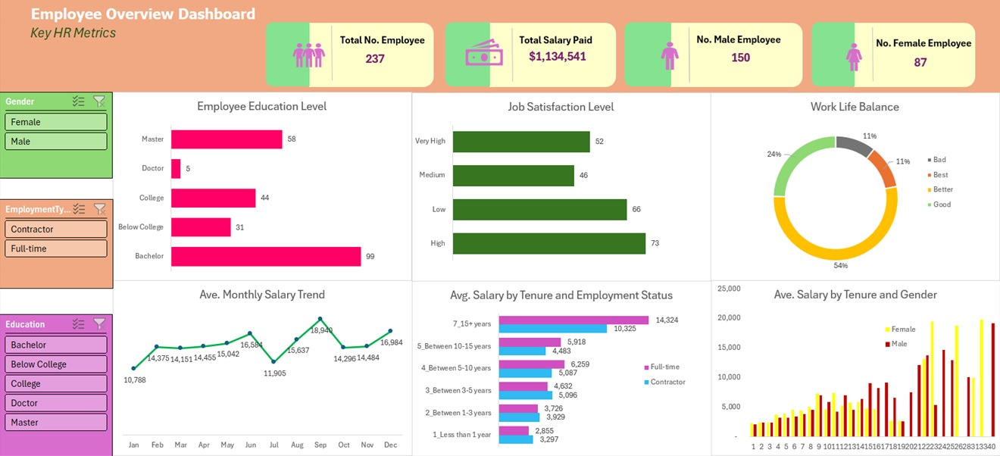

# Employee Overview Dashboard

This interactive Excel dashboard provides a comprehensive overview of key HR metrics to support data-driven decision-making in human resources management. The dashboard is designed to offer insights into workforce demographics, compensation patterns, job satisfaction, and tenure-based performance.
### Key Features:
**Total Workforce Metrics:** Displays total number of employees (237), gender distribution (150 males, 87 females), and total salary paid ($1,134,541).

**Employee Education Profile:** Highlights the distribution of employees based on their highest educational attainment.

**Job Satisfaction Levels:** Categorizes satisfaction levels into Very High, High, Medium, and Low.

**Work-Life Balance:** Visualizes employee perceptions of work-life balance using a donut chart.

**Monthly Salary Trend:** Line graph showing salary changes across months.

**Salary by Tenure and Employment Type:** Bar chart comparing average salaries across years of service for contractors vs full-time staff.

**Salary by Gender and Tenure:** Bar chart illustrating gender-based salary trends across tenure brackets.

### Dataset Summary
The dashboard is based on an HR dataset with the following key fields:

**EmployeeID:** Unique identifier for each employee.

**Gender:** Male/Female

**Employment Type:** Full-time or Contractor

**Education Level:** Below College, College, Bachelor, Master, Doctor

**Years at Company:** Numerical value indicating employee tenure

**Monthly Salary:** Monthly gross salary

**Job Satisfaction:** Level of satisfaction categorized (Low, Medium, High, Very High)

**Work-Life Balance:** Qualitative assessment (Bad, Good, Better, Best)

**Departure Date:** Used to determine if an employee is current or former
